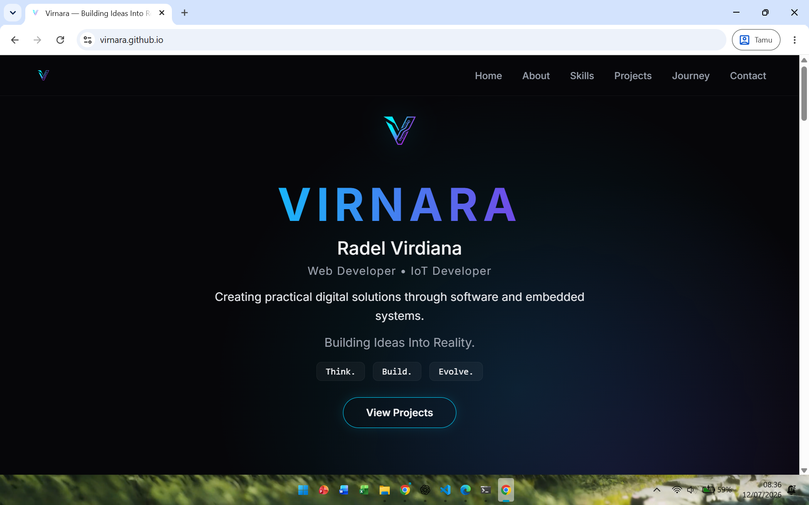

# 🌐 Virnara Portfolio

Official personal portfolio of **Virnara** — showcasing projects, skills, and continuous learning in Web Development and Internet of Things.

[](https://virnara.github.io)


---

## 📸 Preview



---

## ✨ Overview

**Virnara Portfolio** is a modern personal website that showcases my projects, technical skills, and development journey in Web Development and Internet of Things (IoT). It is designed to provide a clean, responsive, and futuristic experience for recruiters, collaborators, and technology enthusiasts.

---

## 🚀 Key Features

- **Responsive Design:** Fully optimized layout for mobile, tablet, and desktop viewports.
- **Modern Minimalist UI:** Futuristic dark theme featuring deep color gradients and glassmorphism cards.
- **Smooth Navigation:** Interactive, dynamic, and intuitive scrolling ecosystem.
- **Semantic HTML5 Structure:** Clean and accessible codebase utilizing modern HTML5 elements.
- **Project Showcase:** Structured classification for personal and collaborative software/IoT works.
- **Interactive Background:** Dynamic cursor-following glow lighting effect built with CSS & JS.

---

## 🛠 Tech Stack

### Frontend & Core
- **HTML5** — Semantic markup & accessible structure
- **CSS3** — Custom properties (variables), Glassmorphism, & Flexbox/Grid layouts
- **JavaScript (ES6+)** — Dynamic interactions & DOM manipulation

### Hosting & Deployment
- **GitHub Pages** — Continuous deployment directly from the `main` branch

---

## 📂 Project Structure

```text
virnara.github.io/
├── assets/
│   ├── css/
│   │   └── style.css
│   ├── images/
│   │   ├── logo-transparent.png
│   │   ├── preview.png
│   │   └── smart-air-monitor.png
│   └── js/
│       └── script.js
├── index.html
└── README.md

```

---

## 💻 Local Development

If you want to run or inspect this project locally:

1. **Clone the repository:**
```bash
git clone [https://github.com/Virnara/virnara.github.io.git](https://github.com/Virnara/virnara.github.io.git)

```


2. **Navigate to the directory:**
```bash
cd virnara.github.io

```


3. **Open `index.html`:**
Simply double-click `index.html` or use the **Live Server** extension in VS Code.

---

## 📩 Contact & Connect

* **Website:** [virnara.github.io](https://virnara.github.io)
* **Email:** [radel.vrdna@gmail.com](mailto:radel.vrdna@gmail.com)
* **GitHub:** [@Virnara](https://github.com/Virnara)

---
